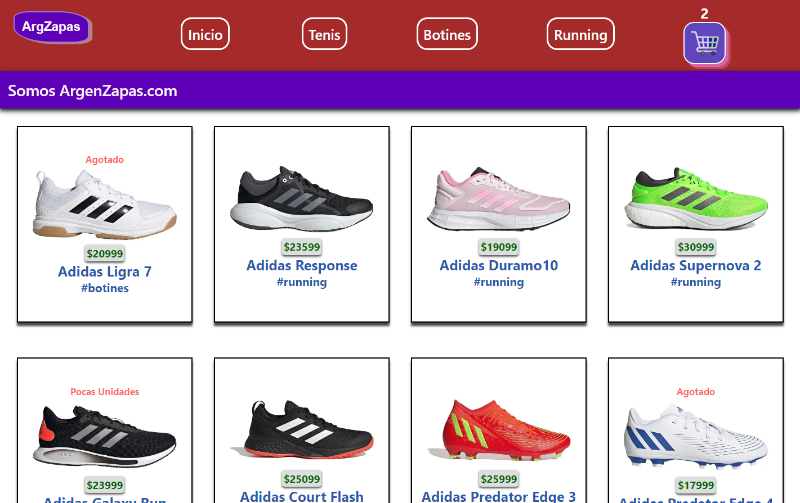

# Proyecto final del curso "React Js" en CoderHouse
## E-comerce de zapatillas.


Esta tienda de zapatillas esta realizada con React donde apliqué todo lo aprendido en el curso, contiene componentes, props, evalua estados, renderizados condicionales, manejo de rutas dinámicas con React-router-dom y filtrados de categorias usando Hooks como : UseState, UseEffec, UseContext y Hooks customizados de FireStore.
Vas a poder ver un listado contenedor con todos los productos, o filtrar por sus 3 categorias, ver el detalle de cada artículo, agregarlo al carrito con la opción de eliminarlo o vaciarlo. Avanzando con la compra, vas a llenar un formulario con validaciones que se va a subir a firestore y verás en pantalla la información de la compra. Tambien cuenta con control de Stock a travéz de la información subida en firestore.

## 🧠 Tecnologías que Utilice:
###  - HTML5
###  - CSS3
###  - React Js
###  - Git
###  - GitHub

## 🧠 Librerías que Utilice:
###  - [React Router Dom](https://www.npmjs.com/package/react-router-dom)
###  - [React Spinners](https://www.npmjs.com/package/react-spinners)
###  - [FireStore DataBase (from Firebase)](https://firebase.google.com/firebase/cloud-firestore)
 

### `Scrips para instalar y correr proyecto`

Para clonar el repositorio debe ejecutar en su consola el siguiente comando:

```
git clone https://github.com/germankern/Proyecto-React.git
```
Instalar todas las librerias y dependencias:

```
npm install
```

Para correr el proyecto en su local ejecutar:

```
npm start
```

## 📌 Contact me at:
#### https://www.linkedin.com/in/germ%C3%A1n-kern-810830252/
#### germankern890@gmail.com

#### 🖥️⌨️ Proyecto realizado por Germán Kern
### Gracias por pasarte 😃!! Recibo sugerencias y propuestas 
